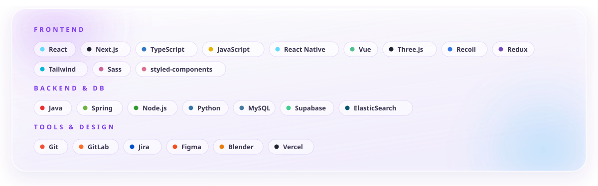

<!-- ========================= HERO ========================= -->

 

  

<!-- ========================= ABOUT ========================= -->

🏢 <b>하나금융티아이 · AI솔루션셀</b> (2024.05~) &nbsp;·&nbsp; 🎓 SSAFY 8기 &nbsp;·&nbsp; 🛠️ 현재 <a href="https://famring.co.kr">famring.co.kr</a> 1인 풀스택 운영 중

<!-- ========================= TECH STACK ========================= -->

<!-- ========================= PROJECTS ========================= -->

🔗 더 많은 프로젝트와 상세 회고는 <a href="https://gnslalsl12.github.io">포트폴리오</a>에서 확인하실 수 있습니다.

<!-- ========================= GITHUB STATS ========================= -->

<!-- ========================= CONNECT ========================= -->

사용자 중심의 인터랙티브한 웹 경험에 대해 이야기 나누고 싶다면 언제든 연락 주세요!

 

  

